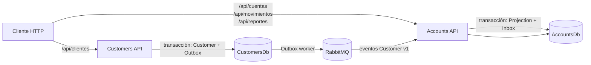

# Devsu Banking Microservices

Solución de la prueba técnica de arquitectura de microservicios implementada con .NET 8, SQL Server, RabbitMQ, Entity Framework Core, Docker Compose y xUnit.

El repositorio contiene dos microservicios desplegables de forma independiente:

- **Customers Service** administra personas y clientes.
- **Accounts Service** administra cuentas, movimientos, correcciones auditadas y estados de cuenta.

El código interno está escrito en inglés. El contrato HTTP que exige el ejercicio —rutas, propiedades JSON, valores de enums y mensajes obligatorios— se conserva en español.

## Inicio rápido con Docker

### Requisitos

- Docker Desktop con Docker Compose v2.
- Al menos 6 GB de memoria disponibles para Docker.
- Puertos `8081`, `8082`, `1433`, `5672` y `15672` libres, o puertos alternativos configurados en `.env`.

.NET SDK y Postman no son necesarios para levantar la aplicación; solo se requieren para ejecutar las pruebas o la colección desde esas herramientas.

### 1. Configurar el entorno

Desde la raíz del repositorio:

```powershell
Copy-Item .env.example .env
```

Los valores de `.env.example` son únicamente para desarrollo local. Antes de usar la solución fuera de una estación aislada, se deben reemplazar todas las contraseñas. El archivo `.env` está excluido de Git.

### 2. Levantar la solución

```powershell
docker compose up --build -d --wait
```

El contenedor `db-init` crea las dos bases, sus usuarios limitados y aplica el script idempotente `BaseDatos.sql`. Las APIs arrancan cuando SQL Server, RabbitMQ y la inicialización están listos.

### 3. Verificar el entorno

```powershell
docker compose ps -a
Invoke-RestMethod http://localhost:8081/health/ready
Invoke-RestMethod http://localhost:8082/health/ready
```

También se incluye un smoke test que crea datos únicos y verifica mensajería, un depósito, saldo insuficiente y reporte:

```powershell
.\scripts\Test-ContainerStack.ps1
```

### URLs locales

| Recurso | URL |
|---|---|
| Customers Swagger | http://localhost:8081/swagger |
| Accounts Swagger | http://localhost:8082/swagger |
| Customers liveness | http://localhost:8081/health/live |
| Customers readiness | http://localhost:8081/health/ready |
| Accounts liveness | http://localhost:8082/health/live |
| Accounts readiness | http://localhost:8082/health/ready |
| RabbitMQ Management | http://localhost:15672 |
| SQL Server | `localhost,1433` |

Las credenciales de RabbitMQ y SQL Server son las configuradas localmente en `.env`.

## Arquitectura



Cada servicio sigue cuatro capas:

- **Domain**: entidades, enums, value objects e invariantes, sin infraestructura.
- **Application**: casos de uso, contratos HTTP y puertos.
- **Infrastructure**: EF Core, SQL Server, repositorios, hashing y RabbitMQ.
- **Api**: controladores, composición, OpenAPI, health checks y `ProblemDetails`.

No existen consultas, claves foráneas ni modelos de dominio compartidos entre servicios. Docker usa una sola instancia de SQL Server para reducir recursos locales, pero crea `CustomersDb` y `AccountsDb` con usuarios y permisos independientes.

La explicación completa, secuencias y decisiones se encuentra en [docs/architecture.md](docs/architecture.md).

## Consistencia eventual y mensajería

Customers Service no publica directamente después de guardar. La modificación del cliente y un registro de outbox se persisten en la misma transacción. Un worker publica el evento persistente en RabbitMQ y espera publisher confirms antes de marcarlo como procesado.

Accounts Service mantiene una proyección mínima del cliente (`CustomerId`, nombre, estado y versión). El evento y su entrada de inbox se aplican en una sola transacción. `EventId` evita duplicados y `AggregateVersion` impide que un evento antiguo revierta la proyección.

Consecuencia visible: inmediatamente después de crear un cliente, `POST /api/cuentas` podría responder temporalmente:

```json
{
  "status": 409,
  "code": "cliente_no_disponible",
  "detail": "El cliente todavía no está disponible en este servicio o se encuentra inactivo. Reintente la operación."
}
```

El consumidor debe reintentar con espera acotada. La colección Postman ya implementa ese comportamiento.

Los contratos versionados de wire están en `contracts/events`; los eventos no transportan contraseña, identificación, dirección ni teléfono.

## API HTTP

Todas las rutas públicas usan el prefijo `/api`.

### Clientes — `http://localhost:8081`

| Método | Ruta | Resultado principal |
|---|---|---|
| `POST` | `/api/clientes` | Crea un cliente; `201` con `Location`. |
| `GET` | `/api/clientes?pagina=1&tamanoPagina=20&estado=true` | Lista paginada. |
| `GET` | `/api/clientes/{clienteId}` | Obtiene un cliente. |
| `PUT` | `/api/clientes/{clienteId}` | Actualiza todos los campos mutables; contraseña nula conserva el hash. |
| `PATCH` | `/api/clientes/{clienteId}/estado` | Activa o desactiva. |
| `DELETE` | `/api/clientes/{clienteId}` | Borrado lógico e idempotente; `204`. |

La contraseña se recibe como `contrasena`, se almacena mediante ASP.NET Core `PasswordHasher` y nunca aparece en respuestas ni eventos.

### Cuentas — `http://localhost:8082`

| Método | Ruta | Resultado principal |
|---|---|---|
| `POST` | `/api/cuentas` | Crea una cuenta para un cliente proyectado y activo. |
| `GET` | `/api/cuentas?pagina=1&tamanoPagina=20&clienteId={guid}&estado=true` | Lista paginada y filtrable. |
| `GET` | `/api/cuentas/{numeroCuenta}` | Obtiene la cuenta y su saldo actual. |
| `PUT` | `/api/cuentas/{numeroCuenta}` | Actualiza tipo, estado y saldo inicial cuando aún es legal. |
| `PATCH` | `/api/cuentas/{numeroCuenta}/estado` | Activa o desactiva. |

El número y el propietario son inmutables. El saldo inicial deja de ser modificable después del primer movimiento.

### Movimientos — `http://localhost:8082`

| Método | Ruta | Resultado principal |
|---|---|---|
| `POST` | `/api/movimientos` | Registra depósito o retiro; exige `Idempotency-Key`. |
| `GET` | `/api/movimientos?numeroCuenta={numero}&fechaInicio={fecha}&fechaFin={fecha}` | Lista paginada y filtrable. |
| `GET` | `/api/movimientos/{movimientoId}` | Obtiene un movimiento. |
| `PUT` | `/api/movimientos/{movimientoId}` | Corrige fecha, tipo y valor, con motivo obligatorio. |

Reglas principales:

- `Deposito` requiere un valor positivo y `Retiro` uno negativo.
- El servidor asigna la fecha y calcula `saldoDisponible`; el cliente no puede enviar el saldo.
- Repetir `Idempotency-Key` con el mismo payload devuelve el movimiento existente con `200`; reutilizarla con otro payload devuelve `409`.
- Un retiro que dejaría saldo negativo devuelve `422` con `detail: "Saldo no disponible"`, sin insertar el movimiento ni alterar la cuenta.
- La escritura toma un bloqueo corto de actualización sobre la cuenta, evitando que dos retiros concurrentes gasten el mismo saldo.
- Una corrección recalcula en orden `fecha`, luego `movimientoId`, todos los saldos afectados y el saldo actual dentro de una única transacción. Si aparece un saldo intermedio negativo, se revierte todo. Cada cambio real queda auditado.

### Reportes — `http://localhost:8082`

```text
GET /api/reportes?fechaInicio=2022-02-01&fechaFin=2022-02-28&clienteId={guid}
```

Las fechas son UTC, inclusivas y el rango máximo es 366 días. El reporte incluye todas las cuentas del cliente aunque no tengan movimientos en el período, e informa saldo inicial, saldo al abrir el período, saldo al cerrarlo y saldo actual. El nombre proviene de la proyección local y, por diseño, es eventualmente consistente.

## Errores

Las APIs responden errores como RFC 7807 `application/problem+json`. Cada respuesta incluye `code` estable para clientes y `traceId` para correlación.

| Estado | Uso |
|---|---|
| `400` | Formato, validación o regla de dominio. |
| `404` | Recurso inexistente. |
| `409` | Duplicado, concurrencia, cuenta inactiva o cliente todavía no proyectado. |
| `422` | Saldo insuficiente. |
| `500` | Error inesperado sin detalles internos. |

Los logs son JSON y no registran contraseñas, connection strings ni payloads sensibles.

## Colección Postman

Archivos:

- `postman/Devsu.Banking.postman_collection.json`
- `postman/Devsu.Banking.Local.postman_environment.json`

La colección usa schema v2.1 y APIs del sandbox compatibles con Postman 9.13.2.

Para reproducir el caso completo:

1. Restablecer el entorno porque los números de cuenta del enunciado son únicos:

   ```powershell
   docker compose down -v
   docker compose up --build -d --wait
   ```

2. Importar primero la colección y después el environment.
3. Seleccionar **Devsu Banking - Local Docker**.
4. Abrir el Collection Runner y ejecutar la colección completa en el orden definido. La espera automática por propagación de clientes solo funciona en el Runner.

La ejecución:

- crea los tres clientes y las cinco cuentas del enunciado;
- guarda automáticamente los identificadores;
- reintenta de forma acotada si la proyección todavía no llegó;
- crea los cuatro movimientos e inspecciona sus saldos;
- comprueba la idempotencia de `POST /movimientos`;
- corrige de forma auditada las fechas de Marianela a febrero de 2022;
- comprueba el retiro rechazado con `422` y `Saldo no disponible`;
- valida el reporte de Marianela;
- incluye ejemplos ejecutables de `GET`, `PUT`, `PATCH` y `DELETE`.

Saldos finales esperados:

| Cuenta | Cálculo | Saldo |
|---|---:|---:|
| `478758` | `2000 - 575` | `1425` |
| `225487` | `100 + 600` | `700` |
| `495878` | `0 + 150` | `150` |
| `496825` | `540 - 540` | `0` |
| `585545` | Sin movimientos | `1000` |

El reporte de Marianela valida la cuenta `225487` con `+600` y saldo `700`, y la cuenta `496825` con `-540` y saldo `0`.

## Compilar y ejecutar pruebas

Requisitos adicionales:

- .NET SDK `8.0.416`, fijado en `global.json`.
- Docker Desktop activo para las pruebas de integración con Testcontainers.

```powershell
dotnet restore --locked-mode
dotnet build -c Release --no-restore
dotnet test -c Release --no-build
dotnet format --verify-no-changes
```

Las pruebas unitarias cubren invariantes de dominio y casos de uso. Las pruebas de integración levantan SQL Server y RabbitMQ reales, alojan ambas APIs con `WebApplicationFactory` y verifican transacciones, concurrencia, idempotencia, outbox, inbox, orden de eventos y reportes.

## Base de datos y migraciones

Las migraciones EF Core son la fuente de verdad. `BaseDatos.sql` es un entregable reproducible que combina:

- creación idempotente de `CustomersDb` y `AccountsDb`;
- logins y usuarios separados;
- permisos mínimos por schema;
- tablas, restricciones, índices y `rowversion`;
- historiales de migración de EF Core.

Para regenerarlo después de cambiar una migración:

```powershell
.\scripts\Generate-DatabaseScript.ps1
git diff -- BaseDatos.sql
```

El script no contiene contraseñas: recibe `CUSTOMERS_DB_PASSWORD` y `ACCOUNTS_DB_PASSWORD` como variables de `sqlcmd` durante `db-init`. Las APIs no ejecutan migraciones al arrancar, lo que evita carreras entre réplicas.

## Operación de contenedores

Detener sin borrar datos:

```powershell
docker compose stop
```

Detener y retirar contenedores conservando los volúmenes:

```powershell
docker compose down
```

Reiniciar desde cero, eliminando de forma irreversible los datos locales de este Compose:

```powershell
docker compose down -v
docker compose up --build -d --wait
```

Ver logs:

```powershell
docker compose logs -f customers-api accounts-api
docker compose logs -f db-init sqlserver rabbitmq
```

## Troubleshooting

### Un puerto ya está ocupado

Cambiar el valor correspondiente en `.env`, por ejemplo:

```text
CUSTOMERS_API_HOST_PORT=8181
ACCOUNTS_API_HOST_PORT=8182
```

Si se cambian los puertos de las APIs, actualizar también `customersBaseUrl` y `accountsBaseUrl` en el environment de Postman.

### `db-init` termina con error

```powershell
docker compose logs db-init sqlserver
```

La causa más común es una contraseña de SQL Server que no satisface su política. Use al menos ocho caracteres y combine mayúsculas, minúsculas, números y símbolos. Si se cambió la contraseña después de crear el volumen, restablezca el entorno con `docker compose down -v`.

### La cuenta responde `cliente_no_disponible`

Es un estado transitorio esperado inmediatamente después de crear el cliente. Verifique que RabbitMQ y ambas APIs estén healthy y reintente durante un máximo acotado. Si persiste:

```powershell
docker compose logs rabbitmq customers-api accounts-api
```

### Readiness falla pero liveness responde

El proceso está vivo, pero SQL Server o RabbitMQ no están disponibles. Revise `docker compose ps -a` y los logs de la dependencia no saludable.

### Las pruebas de integración no inician

Confirme que Docker Desktop esté activo y que el usuario tenga acceso al daemon. Testcontainers descarga o reutiliza imágenes locales de SQL Server y RabbitMQ.

### La colección Postman devuelve duplicados

La colección reproduce números e identificaciones fijos del enunciado. Ejecútela sobre bases limpias con `docker compose down -v` y vuelva a levantar el stack.

## Alcance consciente

La prueba no define autenticación ni autorización, por lo que no se añadió JWT, gateway ni un proveedor de identidad. En producción, la evolución natural sería autenticación OIDC/OAuth 2.0, autorización por scopes, secretos administrados, TLS extremo a extremo y políticas de red. También quedaron fuera Redis, Kubernetes, sagas, event sourcing y tracing distribuido porque no aportan a los requisitos evaluados.

