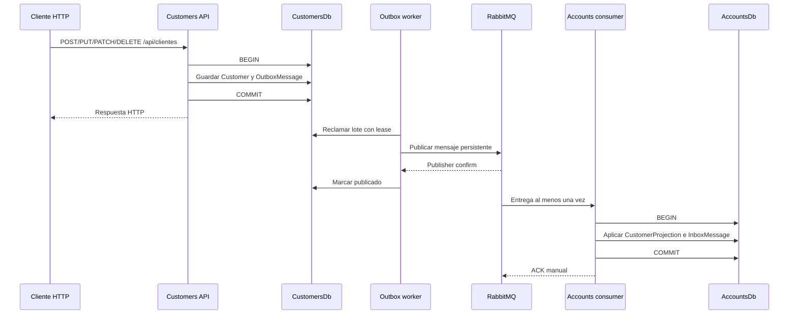
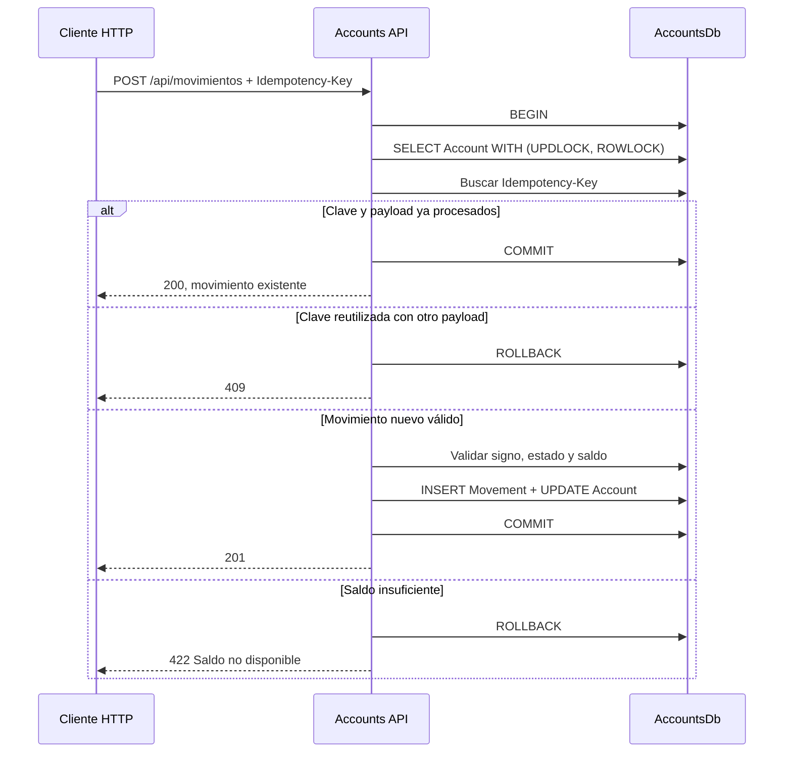

# Arquitectura y decisiones técnicas

## Objetivos

La solución prioriza separación real entre microservicios, consistencia financiera, entrega confiable de eventos y una ejecución local reproducible. El alcance cubre F1–F7 sin introducir componentes que no resuelven la rúbrica.

## Límites de servicio

### Customers Service

Es propietario de `Person`, `Customer`, credenciales, datos personales y ciclo de vida del cliente. `Customer` hereda de `Person`; EF Core persiste la jerarquía con TPT en los schemas y tablas de CustomersDb.

### Accounts Service

Es propietario de `Account`, `AccountMovement`, `AccountMovementCorrection` y reportes. Solo conoce una proyección mínima de cliente alimentada por eventos. No puede consultar tablas ni modelos de Customers Service.

Compartir una instancia de SQL Server es una optimización exclusiva del entorno local. La separación de bases, usuarios, permisos y connection strings permite mover cada base a una instancia diferente sin cambiar el código.

## Flujo de eventos

El exchange topic es `customer.events` y usa routing keys versionadas:

- `customer.created.v1`
- `customer.updated.v1`
- `customer.deleted.v1`

Cada microservicio mantiene su propio DTO del evento. El JSON Schema y una muestra están en `contracts/events`; no se comparte un assembly entre servicios.

### Garantías y límites

- La transacción local hace atómico el cambio de cliente y la creación del outbox.
- Los mensajes se publican como persistentes y se esperan publisher confirms.
- Un lease permite recuperar mensajes si un worker cae durante el procesamiento.
- Los errores de publicación usan backoff exponencial limitado y preservan el último error.
- El consumidor usa acknowledgements manuales y dead-letter queue.
- Inbox con `EventId` único vuelve idempotente el consumo.
- `AggregateVersion` ignora eventos duplicados, antiguos o fuera de orden.
- La garantía efectiva es **at-least-once**, no exactly-once global. La idempotencia produce el efecto observable correcto.

## Transacción de movimientos

El bloqueo se restringe a una cuenta y a una transacción corta. Así se serializan movimientos concurrentes del mismo agregado sin bloquear cuentas distintas. `rowversion` detecta conflictos en actualizaciones optimistas fuera de ese camino.

## Correcciones auditadas

El requisito permite actualizar movimientos, pero editar únicamente la fila objetivo dejaría saldos históricos incorrectos. El flujo elegido es:

1. bloquear la cuenta;
2. obtener el ledger ordenado por `OccurredAtUtc` y `Id`;
3. aplicar fecha, tipo y valor nuevos al objetivo;
4. identificar la posición cronológica más temprana afectada;
5. recalcular desde allí todos los saldos posteriores;
6. rechazar y revertir si cualquier saldo intermedio sería negativo;
7. actualizar el saldo actual de la cuenta;
8. guardar una `AccountMovementCorrection` con valores anteriores, nuevos, motivo y correlación;
9. confirmar todo en una única transacción.

Enviar exactamente el estado ya persistido es un no-op y no genera auditoría duplicada. El cliente nunca puede establecer el saldo calculado.

En un sistema bancario real se preferirían asientos inmutables y movimientos compensatorios. La corrección auditada se eligió aquí porque conserva trazabilidad sin contradecir el `PUT` explícito del ejercicio.

## Reportes

Accounts Service resuelve el estado de cuenta solo con su base local. La consulta:

- usa `AsNoTracking` y proyección directa;
- evita N+1;
- limita el rango a 366 días;
- transforma fechas inclusivas en `[inicio UTC, fin + 1 día UTC)`;
- incluye cuentas sin movimientos;
- calcula apertura con los movimientos anteriores al rango y cierre con los incluidos;
- ordena movimientos por fecha e identificador.

Los índices compuestos cubren cliente/cuenta y cuenta/fecha para acotar lecturas. El nombre puede estar brevemente desactualizado por la consistencia eventual, mientras que saldos y movimientos son consistentes dentro de AccountsDb.

## Decisiones y alternativas

| Decisión | Razón | Alternativa descartada |
|---|---|---|
| Base por servicio | Evita acoplamiento de modelos y despliegues. | Base compartida y joins entre servicios. |
| Eventos asíncronos | Accounts continúa operando sin disponibilidad síncrona de Customers. | Consulta HTTP obligatoria en cada operación. |
| Transactional outbox | Evita perder eventos entre el commit SQL y RabbitMQ. | `SaveChanges` seguido de publicación directa. |
| Inbox y versión de agregado | Tolera duplicados y desorden de una entrega at-least-once. | Confiar en entrega exactamente una vez. |
| `RabbitMQ.Client` directo | Mantiene visible y acotada la infraestructura solicitada. | Framework de mensajería con superficie innecesaria. |
| TPT para `Person`/`Customer` | Representa explícitamente la herencia pedida y PK compartida. | Duplicar persona dentro de cliente. |
| Repositorios por agregado | Expresan las consultas y escrituras necesarias. | Repositorio genérico que oculta semántica. |
| Mapeo explícito | Pocos contratos y comportamiento transparente. | AutoMapper sin beneficio proporcional. |
| Casos de uso explícitos | Flujo fácil de seguir y probar. | MediatR para una solución de este tamaño. |
| `TimeProvider` | Tiempo determinista en pruebas. | Llamadas dispersas a `DateTime.UtcNow`. |
| Borrado lógico de cliente | Conserva trazabilidad e historial financiero. | Eliminación física con referencias rotas. |
| Corrección auditada | Cumple el `PUT` y mantiene el ledger consistente. | Edición aislada o event sourcing fuera de alcance. |
| Sin autenticación en esta entrega | La prueba no define identidad, roles ni login. | JWT decorativo sin emisor ni modelo de permisos. |

## Persistencia y despliegue

Las migraciones EF Core son la fuente de verdad. `scripts/Generate-DatabaseScript.ps1` produce `BaseDatos.sql` usando scripts idempotentes de ambos contextos y una plantilla de bootstrap. `db-init` es un proceso one-shot; las APIs no migran al arrancar.

Los Dockerfiles usan build multi-stage, restauración con lock files, publicación Release y runtime ASP.NET 8. La imagen final se ejecuta con el usuario no root incorporado de .NET. Configuración y credenciales ingresan por variables de entorno.

## Seguridad y privacidad

- Contraseñas con hash y salt; nunca se devuelven ni se propagan.
- Eventos con datos mínimos y sin credenciales ni PII innecesaria.
- Connection strings y secretos fuera del repositorio.
- Usuarios SQL independientes, limitados a DML sobre su propio schema.
- Errores `500` sin stack traces ni detalles internos.
- Logs estructurados con `traceId` y sin cuerpos sensibles.
- Valores de enum enteros rechazados en el contrato JSON.

Autenticación, autorización, TLS y administración externa de secretos son requisitos de producción, pero necesitan decisiones de identidad que el enunciado no proporciona.

## Rendimiento, resiliencia y escalabilidad

- Paginación con máximo de 100 elementos.
- Consultas de reporte acotadas e indexadas.
- Operaciones EF asíncronas y propagación de `CancellationToken`.
- Transacciones financieras cortas y bloqueo por cuenta, no global.
- Outbox por lotes con lease y reintento.
- Publisher confirms, ACK manual y dead-letter queue.
- Health checks separados: liveness solo comprueba proceso; readiness comprueba SQL Server y RabbitMQ.
- Servicios stateless; pueden replicarse. La concurrencia de outbox/inbox se coordina en persistencia.

## Estrategia de pruebas

- **Unitarias**: dominio, casos de uso, validación, cálculo de ledger, correcciones, serialización y retry policy.
- **Integración HTTP**: host real con `WebApplicationFactory` y SQL Server de Testcontainers.
- **Integración de mensajería**: RabbitMQ real, outbox pendiente ante caída, inbox idempotente y versiones antiguas ignoradas.
- **Concurrencia**: dos retiros no pueden consumir el mismo saldo.
- **Regresión de logs**: errores de negocio esperados no se registran como fallos no manejados.
- **End-to-end local**: smoke test de Compose y colección Postman con los datos del enunciado.

